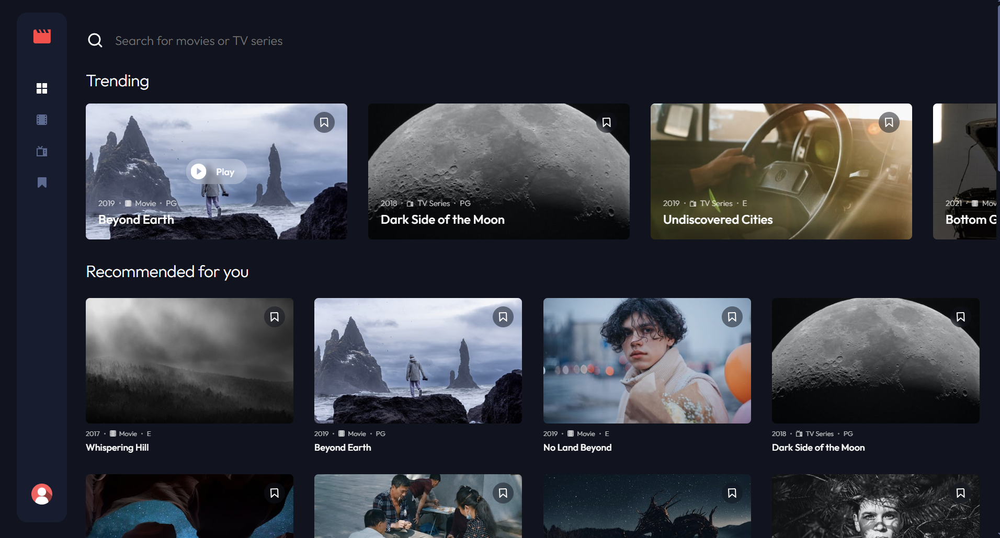
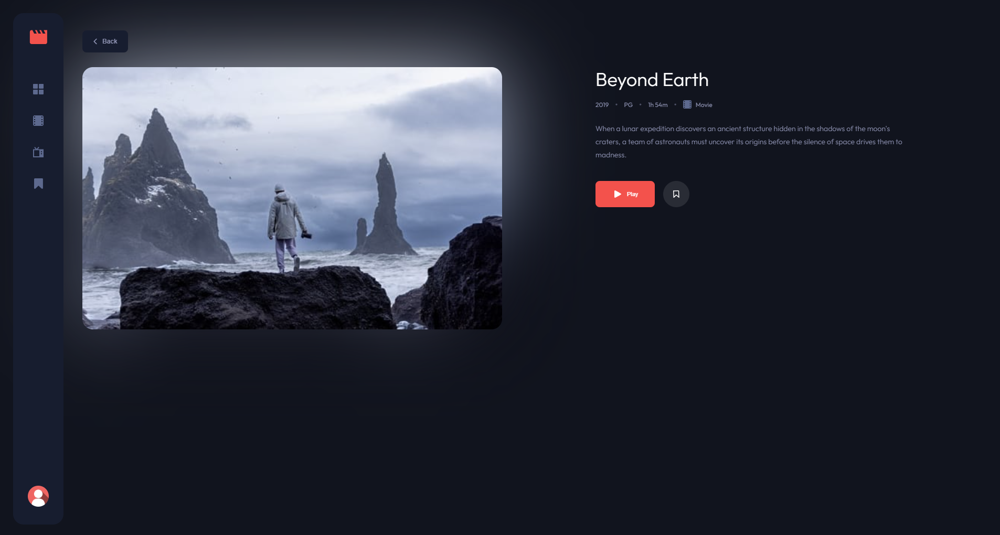
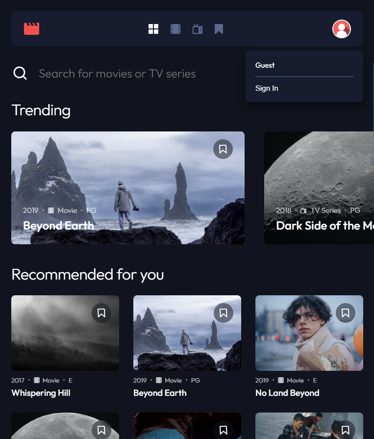
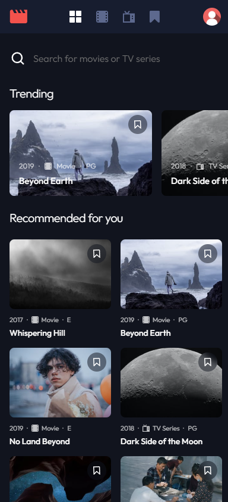
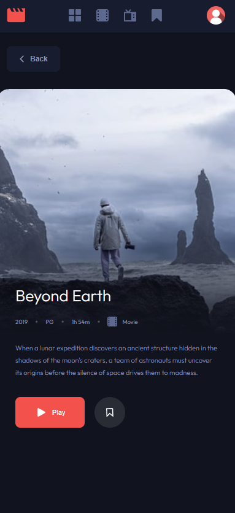

# NG Movies | Premium Entertainment Web App

  
  
  
  
  

   
   

  
  
  

  

---

## About The Project

**NG Movies** is a sleek, fully responsive entertainment web application that allows users to discover, browse, and bookmark their favorite movies and TV series, complete with immersive, dedicated preview pages for individual media titles. Built with a strict mobile-first philosophy, it delivers a cinematic, app-like experience directly in the browser.

Beyond standard media browsing, the application features a robust authentication flow and a frictionless **Guest Mode**. Users can freely explore the content library without creating an account, but are intelligently prompted to sign in when attempting to save bookmarks. Once authenticated, users can seamlessly manage their curated lists via real-time cloud database syncing.

### Key Technical Concepts

This project is engineered using cutting-edge Angular architectures and cloud services, showcasing best practices in performance, security, and UI/UX design:

- **Modern Angular 20 Reactivity:** Completely drops RxJS observables in the UI layer in favor of Angular **Signals** (`signal`, `computed`). This provides granular, boilerplate-free state management and instantaneous DOM updates for form validation and media filtering.
- **Cinematic Routing & Data Binding:** Leverages Angular's modern `withComponentInputBinding` to pass dynamic route parameters (`/movie/:id`) directly into component Signal inputs. The architecture includes state-preserving navigation via the `Location` service, ensuring users don't lose their scroll position or search queries when returning to the grid, alongside intelligent redirect fallbacks for invalid URLs.
- **Hardware-Accelerated UI & Additive Light:** The media preview component utilizes advanced CSS techniques to mimic real-world ambient monitor lighting. By combining stacked images with GPU-accelerated heavy blurs (`transform: translateZ(0)`) and `mix-blend-mode: screen`, it creates a dynamic, content-aware glow that seamlessly fades into the dark UI using responsive `-webkit-mask-image` gradients.
- **Advanced Routing & Security:** Implements modern Functional Route Guards (`canMatch`).
  - _Unauth Guard:_ Intelligently redirects already-logged-in users away from authentication pages.
  - _Auth Guard:_ Protects private routes (like `/bookmarked`) while safely lazily-loading public routes to drastically reduce initial bundle sizes.
- **Frictionless Guest Experience:** Users can browse the entire media catalog as guests. The application gracefully intercepts protected actions (like clicking a bookmark icon) and dynamically routes them to the authentication flow without breaking the application state.
- **Firebase Auth & Atomic Cloud Operations:** Integrates Firebase for secure user authentication. Bookmarking utilizes Firestore's server-side atomic transforms (`arrayUnion`, `arrayRemove`) to guarantee data integrity and completely eliminate client-side race conditions.
- **Bulletproof Form UX:** Authentication forms feature custom SCSS implementations that override aggressive browser autofill stylesheets (`:-webkit-autofill`), maintaining the application's dark-mode aesthetic even when browsers attempt to inject default colors.
- **Custom Global UI Elements:** Features a bespoke, math-driven CSS "Film Reel" loading spinner using polar coordinates, and a root-level dynamic Snackbar notification system to handle Firebase error surfacing globally.

---

## Visual Showcase

<h3>Desktop Experiences</h3>

<h3>Responsive & Mobile Views</h3>

<table align="center" style="border: none; background-color: transparent;">
<tr align="center">
<td><b>Tablet View</b></td>
<td><b>Mobile Grid</b></td>
<td><b>Mobile Preview</b></td>
</tr>
<tr align="center" valign="top">
<td>

</td>
<td>

</td>
<td>

</td>
</tr>
</table>
## Built With

- **Angular 20** - Utilizing strictly Standalone Components, Signals, Functional Guards, and the modern Control Flow syntax (`@if`, `@for`).
- **Firebase / Firestore** - Handling secure User Authentication and real-time NoSQL database syncing for user bookmarks.
- **TypeScript** - Ensuring type-safe data models across the application.
- **SCSS / SASS** - Leveraging the modern `@use` module system (eliminating legacy `@import` duplication), custom mixins, and CSS Custom Properties for a scalable dark theme.
- **CSS Grid & Flexbox** - Creating a fluid layout that dynamically shifts the navigation from a bottom-bar on mobile to a sticky side-panel on 1440px desktop screens.
